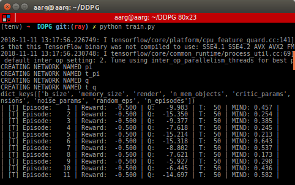
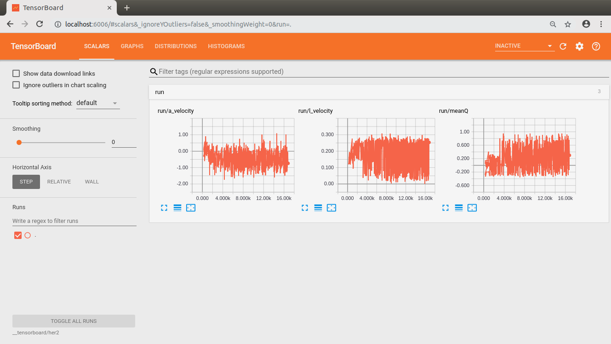

# DDPG
DDPG implementaion with Hindsight Experience Replay (HER) on bare Tensorflow

## Setting up:
1. Clone the repository
```console
foo@bar:~$ git clone https://github.com/abhayraw1/DDPG.git
```

2. Init submodule (This will clone the [Point Environment](https://github.com/aarg-kcis/PointEnvironment.git) repository)
```console
foo@bar:~$ cd DDPG
foo@bar:~/DDPG$ git submodule init
foo@bar:~/DDPG$ git submodule update
```

3. Create a virtual environment. 
It's optional but *highly* recommended to do so. 
You can create virtual environments using `virtualenv` or `conda`. 
Make sure you create the environment for `python3`.

4. Install the necessary dependencies in your virtual environment. Given below is a list of them.
  ```yaml
  tensorflow # for neural nets and stuff
  tensorboard # for visualization purposes
  pyyaml # for parsing yaml config files
  gym # open-ai gym
  ```
  
## Running the code
To train the RL agent simply run
```console
(somevirtualenv) foo@bar:~/DDPG$ python train.py
```
Executing the above code will create two folders named `__checkpoints` and `__tensorboard`.
The former will contain the checkpoints to the policies and value function of the agent.
These checkpoints are only made when the evaluation of the policy results in better performance than the previous best.
The initial policy is always saved.

Runnimg the command abouve would produce something like this:


## Modifying parameters
You can also modify certain parameters from the `config_g2g.yaml` file. 
There are certain parameters that are hardcode as of now and will be added to this file later.

## Visualizing through tensorboard
```console
(somevirtualenv) foo@bar:~/DDPG$ tensorboard --logdir __tensorboard/her2 
TensorBoard 1.10.0 at http://somepcname:6006 (Press CTRL+C to quit)
```
Now you can open an the link returned by tensorboard in your browser.  
It should look something like this:


## References
1. Deep Deterministic Policy Gradients Paper: [Continuous control with deep reinforcement learning
](https://arxiv.org/abs/1509.02971)
2. Hindsight Experience Replay Paper: [Hindsight Experience Replay](https://arxiv.org/abs/1707.01495)
